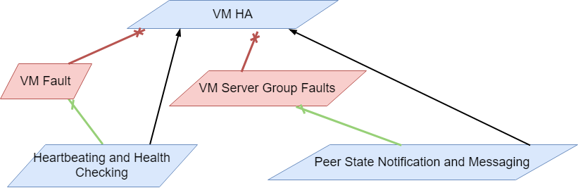
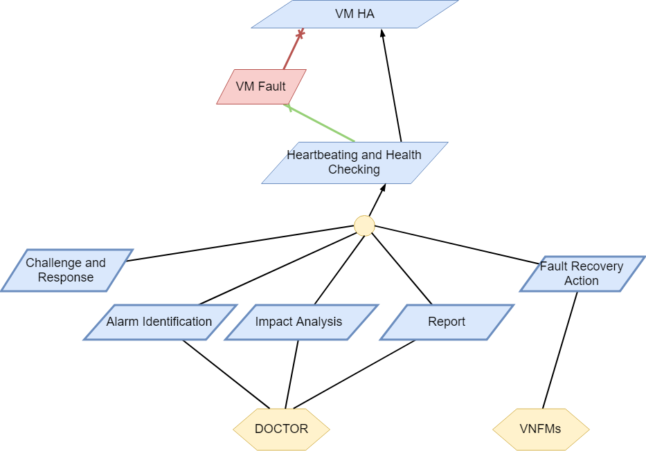
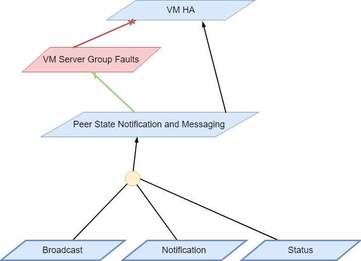
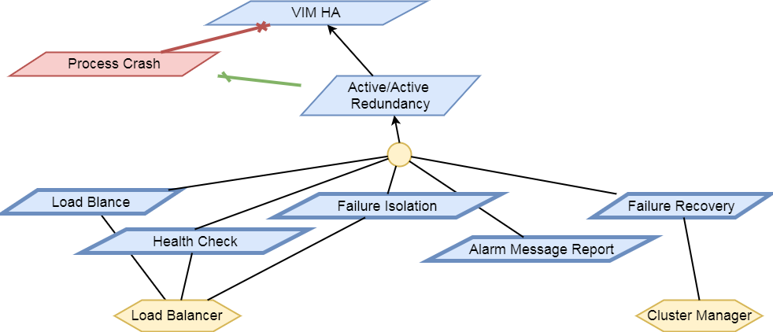

.. image:: opnfv-logo.png
  :height: 40
  :width: 200
  :alt: OPNFV
  :align: left

============
High Availability Requirement Analysis in OPNFV
============

******************
1 Introduction
******************
This High Availability Requirement Analysis Document is used for eliciting High Availability
Requirements of OPNFV. The document will refine high-level High Availability goals, into
detailed HA mechanism design. And HA mechanisms are related with potential failures on
different layers in OPNFV. Moreover, this document can be used as reference for HA Testing
scenarios design.
A requirement engineering model KAOS is used in this document.

******************
2 Terminologies and Symbols
******************
The following concepts in KAOS will be used in the diagrams of this document.

- **Goal**: The objective to be met by the target system.

- **Obstacle**: Condition whose satisfaction may prevent some goals from being achieved.

- **Agent**: Active Object performing operations to achieve goals.

- **Requirement**: Goal assigned to an agent of the software being studied.

- **Domain Property**: Descriptive assertion about objects in the environment of the software.

- **Refinement**: Relationship linking a goal to other goals that are called its subgoals.
  Each subgoal contributes to the satisfaction of the goal it refines. There are two types of
  refinements: AND refinement and OR refinement, which means whether the goal can be archived by
  satisfying all of its sub goals or any one of its sub goals.

- **Conflict**: Relationship linking an obstacle to a goal if the obstacle obstructs the goal
  from being satisfied.

- **Resolution**: Relationship linking a goal to an obstacle if the goal can resolve the
  obstacle.

- **Responsibility**: Relationship between an agent and a requirement. Holds when an agent is
  assigned the responsibility of achieving the linked requirement.

Figure 1 shows how these concepts are displayed in a KAOS diagram.

.. figure:: images/KAOS_Sample.png
    :alt: KAOS Sample
    :figclass: align-center

    Fig 1. A KAOS Sample Diagram

******************
3 High Availability Goals of OPNFV
******************

3.1 Overall Goals
>>>>>>>>>>>>>>>>>>

The Final Goal of OPNFV High Availability is to provide high available VNF services. And the
following objectives are required to meet:

- There should be no single point of failure in the NFV framework.

- All resiliency mechanisms shall be designed for a multi-vendor environment, where for example
  the NFVI, NFV-MANO, and VNFs may be supplied by different vendors.

- Resiliency related information shall always be explicitly specified and communicated using
  the reference interfaces (including policies/templates) of the NFV framework.

3.2 Service Level Agreements of OPNFV HA
>>>>>>>>>>>>>>>>>>>>>>>>>>>>>>>>>>>>>>>>

Service Level Agreements of OPNFV HA are mainly focused on time constraints of service outage,
failure detection, failure recovery. The following table outlines the SLA metrics of different
service availability levels described in ETSI GS NFV-REL 001 V1.1.1 (2015-01). Table 1 shows
time constraints of different Service Availability Levels. In this document, SAL1 is the
default benchmark value required to meet.

*Table 1. Time Constraints for Different Service Availability Levels*

+--------------------------------+----------------------------+------------------------+
| Service Availability Level     | Failure Detection Time     | Failure Recovery Time  |
+================================+============================+========================+
| SAL1                           | <1s                        | 5-6s                   |
+--------------------------------+----------------------------+------------------------+
| SAL2                           | <5s                        | 10-15s                 |
+--------------------------------+----------------------------+------------------------+
| SAL3                           | <10s                       | 20-25s                 |
+--------------------------------+----------------------------+------------------------+

******************
4 Overall Analysis
******************
Figure 2 shows the overall decomposition of high availability goals. The high availability of
VNF Services can be refined to high availability of VNFs, MANO, and the NFVI where VNFs are
deployed; the high availability of NFVI Service can be refined to high availability of Virtual
Compute Instances, Virtual Storage and Virtual Network Services; the high availability of
virtual instance is either the high availability of containers or the high availability of VMs,
and these high availability goals can be further decomposed by how the NFV environment is
deployed.

.. figure:: images/Total_Framework.png
    :alt: Overall HA Analysis of OPNFV
    :figclass: align-center

    Fig 2. Overall HA Analysis of OPNFV

Thus the high availability requirement of VNF services can be classified into high availability
requirements on different layers in OPNFV. The following layers are mainly discussed in this
document:

- VNF HA

- MANO HA

- Virtual Infrastructure HA (container HA or VM HA)

- VIM HA

- SDN HA

- Hypervisor HA

- Host OS HA

- Hardware HA

The next section will illustrate detailed analysis of HA requirements on these layers.

******************
5 Detailed Analysis
******************

5.1 VNF HA
>>>>>>>>>>>>>>>>>>

.. TBD

5.2 MANO HA
>>>>>>>>>>>>>>>>>>

.. TBD

5.3 Virtual Infrastructure HA
>>>>>>>>>>>>>>>>>>

The Virtual Infrastructure in Openstack contains the Guest VMs and the Host VMs. 
This part describes a set of new optional capabilities where the OpenStack Cloud messages into the Guest
VMs in order to provide improved Availability of the Host VMs.

Table 2 shows the potential faults of VMs and corresponding initial solution capabilities or methods. 

*Table 2. Potential Faults of VMs and the initial solution capabilities*

+---------------------------+------------------------------------+--------------------------------------------+
| Fault                     | Description                        | solution capabilities                      |
+===========================+====================================+============================================+
| VM faults                 | General internal VM faults         | VM Heartbeating and Health Checking        |
+---------------------------+------------------------------------+--------------------------------------------+
| VM Server Group faults    | such as split brain                | VM Peer State Notification and Messaging   |
+---------------------------+------------------------------------+--------------------------------------------+

    Fig 3. VM HA Analysis

NOTE: A Server Group here is the OpenStack Nova Server Group concept where VMs
are grouped together for purposes of scheduling.  E.g. A specific Server Group
instance can specify whether the VMs within the group should be scheduled to
run on the same compute host or different compute hosts.  A 'peer' VM in the
context of this section refers to a VM within the same Nova Server Group.

The initial set of new capabilities include: enabling the
detection of and recovery from internal VM faults and providing
a simple out-of-band messaging service to prevent scenarios such
as split brain.

More detailed description is located in R5_HA_API/OPNFV_HA_Guest_APIs-Overview_HLD.rst in this project. 

The Host-to-Guest messaging APIs used by the services discussed
in this Virtual Infrastructure HA part use a JSON-formatted application messaging layer
on top of a virtio serial device between QEMU on the OpenStack Host
and the Guest VM. Use of the virtio serial device provides a
simple, direct communication channel between host and guest which is
independent of the Guest's L2/L3 networking.

The upper layer JSON messaging format is actually structured as a
hierarchical JSON format containing a Base JSON Message Layer and an
Application JSON Message Layer:

- the Base Layer provides the ability to multiplex different groups of message types on top of a single virtio serial device
e.g.

    + heartbeating and healthchecks,
    + server group messaging,

and

- the Application Layer provides the specific message types and fields of a particular group of message types.

VM Heartbeating and Health Checking
::::::::::::::::::::::::::::::::::::::

    Fig 4. Heartbeating and Healthchecks
    
VM Heartbeating and Health Checking provides a heartbeat service to enhance
the monitoring of the health of guest application(s) within a VM running
under the OpenStack Cloud. Loss of heartbeat or a failed health check status
will result in a fault event being reported to OPNFV's DOCTOR infrastructure
for alarm identification, impact analysis and reporting. This would then enable
VNF Managers (VNFMs) listening to OPNFV's DOCTOR External Alarm Reporting through
Telemetry's AODH, to initiate any required fault recovery actions.

Guest heartbeat works on a challenge response model. The OpenStack Guest Heartbeat 
Service on the compute node will challenge the registered Guest VM daemon with a 
message each interval. The registered Guest VM daemon must respond prior to the 
next interval with a message indicating good health. If the OpenStack Host does 
not receive a valid response, or if the response specifies that the VM is in ill 
health, then a fault event for the Guest VM is reported to the OpenStack Guest 
Heartbeat Service on the controller node which will report the event to OPNFV's 
DOCTOR (i.e. thru the Doctor SouthBound (SB) APIs).

In summary, the Guest Heartbeating Messaging Specification is quite simple,
including the following PDUs: Init, Init-Ack, Challenge-Request,
Challenge-Response, Exit.  The Challenge-Response returning a healthy /
not-healthy boolean.

The registered Guest VM daemon's response to the challenge can be as simple
as just immediately responding with OK.  This alone allows for detection of
a failed or hung QEMU/KVM instance, or a failure of the OS within the VM to
schedule the registered Guest VM's daemon or failure to route basic IO within
the Guest VM.

However the registered Guest VM daemon's response to the challenge can be more
complex, running anything from a quick simple sanity check of the health of
applications running in the Guest VM, to a more thorough audit of the
application state and data.  In either case returning the status of the
health check enables the OpenStack host to detect and report the event in order
to initiate recovery from application level errors or failures within the Guest VM.

VM Peer State Notification and Messaging
::::::::::::::::::::::::::::::::::::::::::::

    Fig 5. VM Peer State Notification and Messaging
    
Server Group State Notification and Messaging is a service to provide
simple low-bandwidth datagram messaging and notifications for servers that
are part of the same server group.  This messaging channel is available
regardless of whether IP networking is functional within the server, and
it requires no knowledge within the server about the other members of the group.

This Server Group Messaging service provides three types of messaging:

- Broadcast: this allows a server to send a datagram (size of up to 3050 bytes)
  to all other servers within the server group.
- Notification: this provides servers with information about changes to the
  (Nova) state of other servers within the server group.
- Status: this allows a server to query the current (Nova) state of all servers within
  the server group (including itself).

A Server Group Messaging entity on both the controller node and the compute nodes manage 
the routing of of VM-to-VM messages through the platform, leveraging Nova to determine 
Server Group membership and compute node locations of VMs. The Server Group Messaging 
entity on the controller also listens to Nova VM state change notifications and querys 
VM state data from Nova, in order to provide the VM query and notification functionality 
of this service.

This service is not intended for high bandwidth or low-latency operations. It is best-effort, 
not reliable. Applications should do end-to-end acks and retries if they care about reliability.
      
This service provides building block type capabilities for the Guest VMs that
contribute to higher availability of the VMs in the Guest VM Server Group.  Notifications
of VM Status changes potentially provide a faster and more accurate notification
of failed peer VMs than traditional peer VM monitoring over Tenant Networks.  While
the Broadcast Messaging mechanism provides an out-of-band messaging mechanism to
monitor and control a peer VM under fault conditions; e.g. providing the ability to
avoid potential split brain scenarios between 1:1 VMs when faults in Tenant
Networking occur.

  
5.4 VIM HA
>>>>>>>>>>>>>>>>>>

The VIM in the NFV reference architecture contains different components of Openstack, SDN
controllers and other virtual resource controllers. VIM components can be classified into three
types:

- **Entry Point Components**: Components that give VIM service interfaces to users, like nova-
  api, neutron-server.

- **Middlewares**: Components that provide load balancer services, messaging queues, cluster
  management services, etc.

- **Subcomponents**: Components that implement VIM functions, which are called by Entry Point
  Components but not by users directly.

Table 3 shows the potential faults that may happen on VIM layer. Currently the main focus of
VIM HA is the service crash of VIM components, which may occur on all types of VIM components.
To prevent VIM services from being unavailable, Active/Active Redundancy, Active/Passive
Redundancy and Message Queue are used for different types of VIM components, as is shown in
figure 6.

*Table 3. Potential Faults in VIM level*

+------------+------------------+-------------------------------------------------+----------------+
| Service    | Fault            | Description                                     | Severity       |
+============+==================+=================================================+================+
| General    | Service Crash    | The processes of a service crashed unnormally.  | Critical       |
+------------+------------------+-------------------------------------------------+----------------+

.. figure:: images/VIM_Analysis.png
    :alt: VIM HA Analysis
    :figclass: align-center

    Fig 6. VIM HA Analysis

Active/Active Redundancy
::::::::::::::::::::::::::::
Active/Active Redundancy manages both the main and redundant systems concurrently. If there is
a failure happens on a component, the backups are already online and users are unlikely to
notice that the failed VIM component is under fixing. A typical Active/Active Redundancy will
have redundant instances, and these instances are load balanced via a virtual IP address and a
load balancer such as HAProxy.

When one of the redundant VIM component fails, the load balancer should be aware of the
instance failure, and then isolate the failed instance from being called until it is recovered.
The requirement decomposition of Active/Active Redundancy is shown in Figure 7.

    Fig 7. Active/Active Redundancy Requirement Decomposition

The following requirements are elicited for VIM Active/Active Redundancy:

**[Req 5.4.1]** Redundant VIM components should be load balanced by a load balancer.

**[Req 5.4.2]** The load balancer should check the health status of VIM component instances.

**[Req 5.4.3]** The load balancer should isolate the failed VIM component instance until it is
recovered.

**[Req 5.4.4]** The alarm information of VIM component failure should be reported.

**[Req 5.4.5]** Failed VIM component instances should be recovered by a cluster manager.

Table 3 shows the current VIM components using Active/Active Redundancy and the corresponding
HA test cases to verify them.

*Table 4. VIM Components using Active/Active Redundancy*

+-------------------+-------------------------------------------------------+----------------------+
| Component         | Description                                           | Related HA Test Case |
+===================+=======================================================+======================+
| nova-api          | endpoint component of Openstack Compute Service Nova  | yardstick_tc019      |
+-------------------+-------------------------------------------------------+----------------------+
| nova-novncproxy   | server daemon that serves the Nova noVNC Websocket    |                      |
|                   | Proxy service, which provides a websocket proxy that  |                      |
|                   | is compatible with OpenStack Nova noVNC consoles.     |                      |
+-------------------+-------------------------------------------------------+----------------------+
| neeutron-server   | endpoint component of Openstack Networking Service    | yardstick_tc045      |
|                   | Neutron                                               |                      |
+-------------------+-------------------------------------------------------+----------------------+
| keystone          | component of Openstack Identity Service Service       | yardstick_tc046      |
|                   | Keystone                                              |                      |
+-------------------+-------------------------------------------------------+----------------------+
| glance-api        | endpoint component of Openstack Image Service Glance  | yardstick_tc047      |
+-------------------+-------------------------------------------------------+----------------------+
| glance-registry   | server daemon that serves image metadata through a    |                      |
|                   | REST-like API.                                        |                      |
+-------------------+-------------------------------------------------------+----------------------+
| cinder-api        | endpoint component of Openstack Block Storage Service | yardstick_tc048      |
|                   | Service Cinder                                        |                      |
+-------------------+-------------------------------------------------------+----------------------+
| swift-proxy       | endpoint component of Openstack Object Storage        | yardstick_tc049      |
|                   | Swift                                                 |                      |
+-------------------+-------------------------------------------------------+----------------------+
| horizon           | component of Openstack Dashboard Service Horizon      |                      |
+-------------------+-------------------------------------------------------+----------------------+
| heat-api          | endpoint component of Openstack Stack Service Heat    |                      |
+-------------------+-------------------------------------------------------+----------------------+
| mysqld            | database service of VIM components                    |                      |
+-------------------+-------------------------------------------------------+----------------------+

Active/Passive Redundancy
::::::::::::::::::::::::::::

Active/Passive Redundancy maintains a redundant instance that can be brought online when the
active service fails. A typical Active/Passive Redundancy maintains replacement resources that
can be brought online when required. Requests are handled using a virtual IP address (VIP) that
facilitates returning to service with minimal reconfiguration. A cluster manager (such as
Pacemaker or Corosync) monitors these components, bringing the backup online as necessary.

When the main instance of a VIM component is failed, the cluster manager should be aware of the
failure and switch the backup instance online. And the failed instance should also be recovered
to another backup instance. The requirement decomposition of Active/Passive Redundancy is shown
in Figure 8.

.. figure:: images/Active_Passive_Redundancy.png
    :alt: Active/Passive Redundancy Requirement Decomposition
    :figclass: align-center

    Fig 8. Active/Passive Redundancy Requirement Decomposition

The following requirements are elicited for VIM Active/Passive Redundancy:

**[Req 5.4.6]** The cluster manager should replace the failed main VIM component instance with
a backup instance.

**[Req 5.4.7]** The cluster manager should check the health status of VIM component instances.

**[Req 5.4.8]** Failed VIM component instances should be recovered by the cluster manager.

**[Req 5.4.9]** The alarm information of VIM component failure should be reported.

Table 4 shows the current VIM components using Active/Passive Redundancy and the corresponding
HA test cases to verify them.

*Table 5. VIM Components using Active/Passive Redundancy*

+-------------------+-------------------------------------------------------+----------------------+
| Component         | Description                                           | Related HA Test Case |
+===================+=======================================================+======================+
| haproxy           | load balancer component of VIM components             | yardstick_tc053      |
+-------------------+-------------------------------------------------------+----------------------+
| rabbitmq-server   | messaging queue service of VIM components             | yardstick_tc056      |
+-------------------+-------------------------------------------------------+----------------------+
| corosync          | cluster management component of VIM components        | yardstick_tc057      |
+-------------------+-------------------------------------------------------+----------------------+

Message Queue
::::::::::::::::::::::::::::
Message Queue provides an asynchronous communication protocol. In Openstack, some projects (
like Nova, Cinder) use Message Queue to call their sub components. Although Message Queue
itself is not an HA mechanism, how it works ensures the high availaibility when redundant
components subscribe to the Messsage Queue. When a VIM sub component fails, since there are
other redundant components are subscribing to the Message Queue, requests still can be processed.
And fault isolation can also be archived since failed components won't fetch requests actively.
Also, the recovery of failed components is required. Figure 9 shows the requirement
decomposition of Message Queue.

.. figure:: images/Message_Queue.png
    :alt: Message Queue Requirement Decomposition
    :figclass: align-center

    Fig 9. Message Queue Redundancy Requirement Decomposition

The following requirements are elicited for Message Queue:

**[Req 5.4.10]** Redundant component instances should subscribe to the Message Queue, which is
implemented by the installer.

**[Req 5.4.11]** Failed VIM component instances should be recovered by the cluster manager.

**[Req 5.4.12]** The alarm information of VIM component failure should be reported.

Table 5 shows the current VIM components using Message Queue and the corresponding HA test cases
to verify them.

*Table 6. VIM Components using Messaging Queue*

+-------------------+-------------------------------------------------------+----------------------+
| Component         | Description                                           | Related HA Test Case |
+===================+=======================================================+======================+
| nova-scheduler    | Openstack compute component determines how to         |                      |
|                   | dispatch compute requests                             |                      |
+-------------------+-------------------------------------------------------+----------------------+
| nova-cert         | Openstack compute component that serves the Nova Cert |                      |
|                   | service for X509 certificates. Used to generate       |                      |
|                   | certificates for euca-bundle-image.                   |                      |
+-------------------+-------------------------------------------------------+----------------------+
| nova-conductor    | server daemon that serves the Nova Conductor service, |                      |
|                   | which provides coordination and database query        |                      |
|                   | support for Nova.                                     |                      |
+-------------------+-------------------------------------------------------+----------------------+
| nova-compute      | Handles all processes relating to instances (guest    |                      |
|                   | vms). nova-compute is responsible for building a disk |                      |
|                   | image, launching it via the underlying virtualization |                      |
|                   | driver, responding to calls to check its state,       |                      |
|                   | attaching persistent storage, and terminating it.     |                      |
+-------------------+-------------------------------------------------------+----------------------+
| nova-consoleauth  | Openstack compute component for Authentication of     |                      |
|                   | nova consoles.                                        |                      |
+-------------------+-------------------------------------------------------+----------------------+
| cinder-scheduler  | Openstack volume storage component decides on         |                      |
|                   | placement for newly created volumes and forwards the  |                      |
|                   | request to cinder-volume.                             |                      |
+-------------------+-------------------------------------------------------+----------------------+
| cinder-volume     | Openstack volume storage component receives volume    |                      |
|                   | management requests from cinder-api and               |                      |
|                   | cinder-scheduler, and routes them to storage backends |                      |
|                   | using vendor-supplied drivers.                        |                      |
+-------------------+-------------------------------------------------------+----------------------+
| heat-engine       | Openstack Heat project server with an internal RPC    |                      |
|                   | api called by the heat-api server.                    |                      |
+-------------------+-------------------------------------------------------+----------------------+

5.5 Hypervisor HA
>>>>>>>>>>>>>>>>>>

.. TBD

5.6 Host OS HA
>>>>>>>>>>>>>>>>>>

.. TBD

5.7 Hardware HA
>>>>>>>>>>>>>>>>>>

.. TBD

******************
6 References
******************

- A KAOS Tutorial: http://www.objectiver.com/fileadmin/download/documents/KaosTutorial.pdf

- ETSI GS NFV-REL 001 V1.1.1(2015-01):
  http://www.etsi.org/deliver/etsi_gs/NFV-REL/001_099/001/01.01.01_60/gs_NFV-REL001v010101p.pdf

- Openstack High Availability Guide: https://docs.openstack.org/ha-guide/

- Highly Available (Mirrored) Queues: https://www.rabbitmq.com/ha.html
