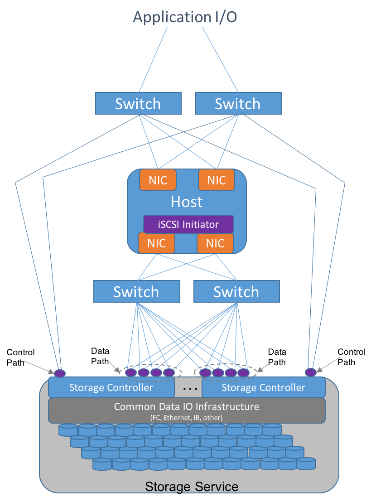
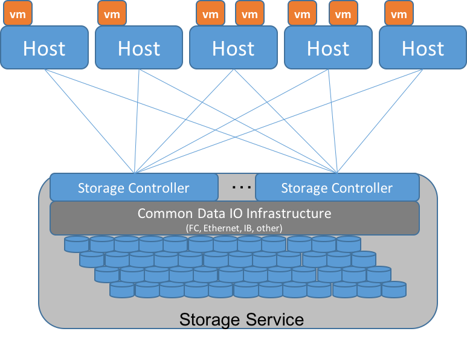
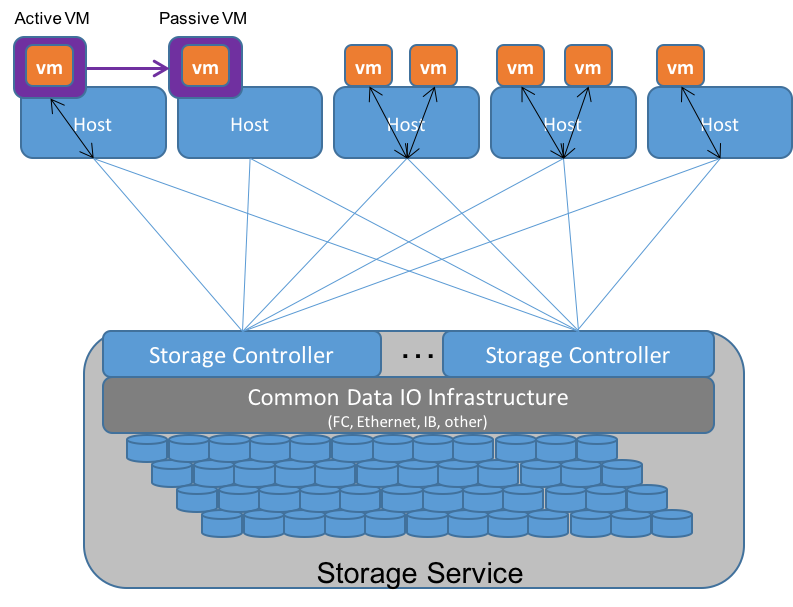

Storage and High Availability Scenarios
=======================================

Elements of HA Storage Management and Delivery
----------------------------------------------

Storage infrastructure, in any environment, can be broken down into two
domains: Data Path and Control Path. Generally, High Availability of the
storage infrastructure is measured by the occurence of Data
Unavailability and Data Loss (DU/DL) events. While that meaning is
obvious as it relates to the Data Path, it is also applicable to Control
Path as well. The inability to attach a volume that has data to a host,
for example, can be considered a Data Unavailability event. Likewise,
the inability to create a volume to store data could be considered Data
Loss since it may result in the inability to store critical data.

Storage HA mechanisms are an integral part of most High Availability
solutions today. In the first two sections below, we define the
mechanisms of redundancy and protection required in the infrastructure
for storage delivery in both the Data and Control Paths. Storage
services that have these mechanisms can be used in HA environments that
are based on a highly available storage infrastructure.

In the third section below, we examine HA implementations that rely on
highly available storage infrastructure. Note that the scope throughout this
section is focused on local HA solutions. This does not address rapid remote
Disaster Recovery scenarios that may be provided by storage, nor
does it address metro active/active environments that implement stretched 
clusters of hosts across multiple sites for workload migration and availability.

Storage Failure & Recovery Scenarios: Storage Data Path
-------------------------------------------------------

In the failure and recovery scenarios described below, a redundant
network infrastructure provides HA through network-related device
failures, while a variety of strategies are used to reduce or minimize
DU/DL events based on storage system failures. This starts with redundant
storage network paths, as shown in Figure 1.

     
     Figure 1: Typical Highly Available Storage Infrastructure
     
Storage implementations vary tremendously, and the recovery mechanisms
for each implementation will vary. These scenarios described below are
limited to 1) high level descriptions of the most common implementations 
since it is unpredictable as to
which storage implementations may be used for NFVI; 2) HW- and
SW-related failures (and recovery) of the storage data path, and not
anything associated with user configuration and operational issues which
typically create the most common storage failure scenarios; 3)
non-LVM/DAS based storage implementations(managing failure and recovery
in LVM-based storage for OpenStack is a very different scenario with
less of a reliable track record); and 4) I will assume block storage
only, and not object storage, which is often used for stateless
applications (at a high level, object stores may include a
subset of the block scenarios under the covers).

To define the requirements for the data path, I will start at the
compute node and work my way down the storage IO stack and touch on both
HW and SW failure/recovery scenarios for HA along the way. I will use Figure 1 as a reference.

1. Compute IO driver: Assuming iSCSI for connectivity between the
compute and storage, an iSCSI initiator on the compute node maintains
redundant connections to multiple iSCSI targets for the same storage
service. These redundant connections may be aggregated for greater
throughput, or run independently. This redundancy allows the iSCSI
Initiator to handle failures in network connectivity from compute to
storage infrastructure. (Fibre Channel works largely the same way, as do
proprietary drivers that connect a host's IO stack to storage systems).

2. Compute node network interface controller (NIC): This device may
fail, and said failure reported via whatever means is in place for such
reporting from the host.The redundant paths between iSCSI initiators and
targets will allow connectivity from compute to storage to remain up,
though operating at reduced capacity.

3. Network Switch failure for storage network: Assuming there are
redundant switches in place, and everything is properly configured so
that two compute NICs go to two separate switches, which in turn go to
two different storage controllers, then a switch may fail and the
redundant paths between iSCSI initiators and targets allows connectivity
from compute to storage to operational, though operating at reduced
capacity.

4. Storage system network interface failure: Assuming there are
redundant storage system network interfaces (on separate storage
controllers), then one may fail and the redundant paths between iSCSI
initiators and targets allows connectivity from compute to storage to
remain operational, though operating at reduced performance. The extent
of the reduced performance is dependent upon the storage architecture.
See 3.5 for more.

5. Storage controller failure: A storage system can, at a very high
level, be described as composed of network interfaces, one or more
storage controllers that manage access to data, and a shared Data Path
access to the HDD/SSD subsystem. The network interface failure is
described in #4, and the HDD/SSD subsystem is described in #6. All
modern storage architectures have either redundant or distributed
storage controller architectures. In **dual storage controller
architectures**, high availability is maintained through the ALUA
protocol maintaining access to primary and secondary paths to iSCSI
targets. Once a storage controller fails, the array operates in
(potentially) degraded performance mode until the failed storage controller is
replaced. The degree of reduced performance is dependent on the overall
original load on the array. Dual storage controller arrays also remain at risk
of a Data Unavailability event if the second storage controller should fail.
This is rare, but should be accounted for in planning support and
maintenance contracts.

**Distributed storage controller architectures** are generally server-based,
which may or may not operate on the compute servers in Converged
Infrastructure environments. Hence the concept of “storage controller”
is abstract in that it may involve a distribution of software components
across multiple servers. Examples: Ceph and ScaleIO. In these environments, 
the data may be stored
redundantly, and metadata for accessing the data in these redundant
locations is available for whichever compute node needs the data (with
authorization, of course). Data may also be stored using erasure coding
(EC) for greater efficiency. The loss of a storage controller in this
context leads to a discussion of impact caused by loss of a server in
this distributed storage controller architecture. In the event of such a loss,
if data is held in duplicate or triplicate on other servers, then access
is simply redirected to maintain data availability. In the case of
EC-based protection, then the data is simply re-built on the fly. The
performance and increased risk impact in this case is dependent on the
time required to rebalance storage distribution across other servers in
the environment. Depending on configuration and implementation, it could
impact storage access performance to VNFs as well.

6. HDD/SSD subsystem: This subsystem contains any RAID controllers,
spinning hard disk drives, and Solid State Drives. The failure of a RAID
controller is equivalent to failure of a storage controller, as
described in 5 above. The failure of one or more storage devices is
protected by either RAID parity-based protection, Erasure Coding
protection, or duplicate/triplicate storage of the data. RAID and
Erasure Coding are typically more efficient in terms of space
efficiency, but duplicate/triplicate provides better performance. This
tradeoff is a common point of contention among implementations, and this
will not go into greater detail than to assume that failed devices do
not cause Data Loss events due to these protection algorithms. Multiple
device failures can potentially cause Data Loss events, and the risk of
each method must be taken into consideration for the HA requirements of
the desired deployment.

Storage Failure & Recovery Scenarios: Storage Control Path
----------------------------------------------------------

As it relates to an NFVI environment, as proposed by OPNFV, there are
two parts to the storage control path.

* The storage system-specific control path to the storage controller 

* The OpenStack-specific cloud management framework for managing different
storage elements

Storage System Control Paths 
~~~~~~~~~~~~~~~~~~~~~~~~~~~~

High Availability of a storage controller is storage
system-specific. Breaking it down to implementation variants is the best
approach. However, both variants assume an IP-based management API in
order to leverage network redundancy mechanisms for ubiquitous
management access.

An appliance style storage array with dual storage controllers must implement IP
address failover for the management API's IP endpoint in either an
active/active or active/passive configuration. Likewise, a storage array
with >2 storage controllers would bring up a management endpoint on
another storage controller in such an event. Cluster-style IP address load
balancing is also a viable implementation in these scenarios.

In the case of distributed storage controller architectures, the storage system
provides redundant storage controller interfaces. E.g., Ceph's RADOS provides
redundant paths to access an OSD for volume creation or access. In EMC's
ScaleIO, there are redundant MetaData Managers for managing volume
creation and access. In the case of the former, the access is via
proprietary protocol, in the case of the latter, it is via HTTP-based
REST API. Other storage implementations may also provide alternative
methods, but any enterprise-class storage system will have built-in HA
for management API access.

Finally, note that single server-based storage solutions, such as LVM,
do not have HA solutions for control paths. If the server is failed, the
management of that server's storage is not available.

OpenStack Controller Management 
~~~~~~~~~~~~~~~~~~~~~~~~~~~~~~~

OpenStack cloud management is comprised of a number of different
function-specific management modules such as Keystone for Identity and
Access management (IAM), Nova for compute management, Cinder for block
storage management, Swift for Object Storage delivery, Neutron for
Network management, and Glance as an image repository. In smaller
single-cloud environments, these management systems are managed in
concert for High Availability; in larger multi-cloud environments, the
Keystone IAM may logically stand alone in its own HA delivery across the
multiple clouds, as might Swift as a common Object Store. Nova, Cinder,
and Glance may have separate scopes of management, but they are more
typically managed together as a logical cloud deployment.

It is the OpenStack deployment mechanisms that are responsible for HA
deployment of these HA management infrastructures. These tools, such as
Fuel, RDO, and others, have matured to include highly available
implementations for the database, the API, and each of the manager
modules associated with the scope of cloud management domains.

There are many interdependencies among these modules that impact Cinder high availability. 
For example: 

* Cinder is implemented as an Active/Standby failover implementation since it 
requires a single point of control at one time for the Cinder manager/driver implementation.
The Cinder manager/driver is deployed on two of the three OpenStack controller nodes, and
one is made active while the other is passive. This may be improved to active/active 
in a future release.

* A highly available database implementation must be delivered
using something like  MySQL/Galera replication across the 3 OpenStack controller
nodes. Cinder requires an HA database in order for it to be HA.

* A redundant RabbitMQ messaging implementation across the same
three OpenStack controller nodes. Likewise, Cinder requires an HA messaging system.

* A redundant OpenStack API to ensure Cinder requests can be delivered.

* An HA Cluster Manager, like PaceMaker for monitoring each of the
deployed manager elements on the OpenStack controllers, with restart capability. 
Keepalived is an alternative implementation for monitoring processes and restarting on
alternate OpenStack controller nodes. While statistics are lacking, it is generally 
believed that the PaceMaker implementation is more frequently implemented
in HA environments.

For more information on OpenStack and Cinder HA, see http://docs.openstack.org/ha-guide 
for current thinking.

While the specific combinations of management functions in these
redundant OpenStack controllers may vary with the specific small/large environment
deployment requirements, the basic implementation of three OpenStack controller
redundancy remains relatively common. In these implementations, the
highly available OpenStack controller environment provides HA access to
the highly available storage controllers via the highly available IP
network.

The Role of Storage in HA 
-------------------------

In the sections above, we describe data and control path requirements
and example implementations for delivery of highly available storage
infrastructure. In summary:

* Most modern storage infrastructure implementations are inherently
highly available. Exceptions certainly apply; e.g., simply using LVM for
storage presentation at each server does not satisfy HA requirements.
However, modern storage systems such as Ceph, ScaleIO, XIV, VNX, and
many others with OpenStack integrations, certainly do have such HA
capabilities.

* This is predominantly through network-accessible shared storage
systems in tightly coupled configurations such as clustered hosts, or in
loosely coupled configurations such as with global object stores.

Storage is an integral part of HA delivery today for applications,
including VNFs. This is examined below in terms of using storage as a
key part of HA delivery, the possible scope and limitations of that
delivery, and example implementations for delivery of such service. We
will examine this across several different varieties of implementation:

1. Comparing VNF HA vs VNFC HA vs VM HA in a shared block storage HA
context 2. Shared file storage in clustered host environments 3. Shared
file storage in loosely coupled compute environments 4. Global (or
local) object stores in loosely coupled compute environments

VNF, VNFC, and VM HA in a Block Storage HA Context
~~~~~~~~~~~~~~~~~~~~~~~~~~~~~~~~~~~~~~~~~~~~~~~~~~

Several scenarios were described in another section with regard to
managing HA at the VNFC level, with variants of recovery based on either
VIM- or VNFM-based reporting/detection/recovery mechanisms. In a block
storage environment, these differentiations are abstract and
meaningless, regardless of whether it is or is not intended to be HA.

In a block storage context, HA is delivered via a logical block device
(sometimes called a Logical Unit, or LUN), or in some cases, to a VM.
VM and logical block devices are the units of currency.

     
     Figure 2: Typical HA Cluster With Shared Storage
     
In Figure 2, several hosts all share access, via an IP network
or via Fibre Channel, to a common set of logical storage devices. In an
ESX cluster implementation, these hosts all access all devices with
coordination provided with the SCSI Reservation mechanism. In the
particular ESX case, the logical storage devices provided by the storage
service actually aggregate volumes (VMDKs) utilized by VMs. As a result,
multiple host access to the same storage service logical device is
dynamic. The vSphere management layer provides for host cluster
management.

In other cases, such as for KVM, cluster management is not formally
required, per se, because each logical block device presented by the
storage service is uniquely allocated for one particular VM which can
only execute on a single host at a time. In this case, any host that can
access the same storage service is potentially a part of the "cluster".
While *potential* access from another host to the same logical block
device is necessary, the actual connectivity is restricted to one host
at a time. This is more of a loosely coupled cluster implementation,
rather than the tightly coupled cluster implementation of ESX.

So, if a single VNF is implemented as a single VM, then HA is provided
by allowing that VM to execute on a different host, with access to the
same logical block device and persistent data for that VM, located on
the storage service. This also applies to multiple VNFs implemented
within a single VM, though it impacts all VNFs together.

If a single VNF is implemented across multiple VMs as multiple VNFCs, 
then all of the VMs that comprise the VNF may need to be protected in a consistent 
fashion.  The storage service is not aware of the
distinction from the previous example. However, a higher level
implementation, such as an HA Manager (perhaps implemented in a VNFM)
may monitor and restart a collection of VMs on alternate hosts. In an ESX environment,
VM restarts are most expeditiously handled by using vSphere-level HA
mechanisms within an HA cluster for individual or collections of VMs. 
In KVM environments, a separate HA
monitoring service, such as Pacemaker, can be used to monitor individual
VMs, or entire multi-VM applications, and provide restart capabilities
on separately configured hosts that also have access to the same logical
storage devices.

VM restart times, however, are measured in 10's of seconds. This may
sometimes meet the SAL-3 recovery requirements for General Consumer,
Public, and ISP Traffic, but will  never meet the 5-6 seconds required
for SAL-1 Network Operator Control and Emergency Services. For this,
additional capabilities are necessary.

In order to meet SAL-1 restart times, it is necessary to have: 1. A hot
spare VM already up and running in an active/passive configuration 2.
Little-to-no-state update requirements for the passive VM to takeover.

Having a spare VM up and running is easy enough, but putting that VM in
an appropriate state to take over execution is the difficult part. In shared storage
implementations for Fault Tolerance, which can achieve SAL-1 requirements, 
the VMs share access to the same storage device, and another wrapper function
is used to update internal memory state for every interaction to the active
VM. 

This may be done in one of two ways, as illustrated in Figure 3. In the first way,
the hypervisor sends all interface interactions to the passive as well
as the active VM. The interaction is handled completely by
hypervisor-to-hypervisor wrappers, as represented by the purple box encapsulating 
the VM in Figure 3, and is completely transparent to the VM.
This is available with the vSphere Fault Tolerant option, but not with
KVM at this time.

     
     Figure 3: A Fault Tolerant Host/Storage Configuration
     
In the second way, a VM-level wrapper is used to capture checkpoints of
state from the active VM and transfers these to the passive VM, similarly represented 
as the purple box encapsulating the VM in Figure 3. There
are various levels of application-specific integration required for this
wrapper to capture and transfer checkpoints of state, depending on the
level of state consistency required. OpenSAF is an example of an
application wrapper that can be used for this purpose. Both techniques
have significant network bandwidth requirements and may have certain
limitations and requirements for implementation.

In both cases, the active and passive VMs share the same storage infrastructure. 
Although the OpenSAF implementation may also utilize separate storage infrastructure 
as well (not shown in Figure 3).

Looking forward to the long term, both of these may be made obsolete. As soon as 2016,
PCIe fabrics will start to be available that enable shared NVMe-based
storage systems. While these storage systems may be used with
traditional protocols like SCSI, they will also be usable with true
NVMe-oriented applications whose memory state are persisted, and can be
shared, in an active/passive mode across hosts. The HA mechanisms here
are yet to be defined, but will be far superior to either of the
mechanisms described above. This is still a future.

HA and Object stores in loosely coupled compute environments
~~~~~~~~~~~~~~~~~~~~~~~~~~~~~~~~~~~~~~~~~~~~~~~~~~~~~~~~~~~~

Whereas block storage services require tight coupling of hosts to
storage services via SCSI protocols, the interaction of applications
with HTTP-based object stores utilizes a very loosely coupled
relationship. This means that VMs can come and go, or be organized as an
N+1 redundant deployment of VMs for a given VNF. Each individual object
transaction constitutes the duration of the coupling, whereas with
SCSI-based logical block devices, the coupling is active for the
duration of the VM's mounting of the device.

However, the requirement for implementation here is that the state of a
transaction being performed is made persistent to the object store by
the VM, as the restartable checkpoint for high availability. Multiple
VMs may access the object store somewhat simultaneously, and it is
required that each object transaction is made idempotent by the
application.

HA restart of a transaction in this environment is dependent on failure
detection and transaction timeout values for applications calling the
VNFs. These may be rather high and even unachievable for the SAL
requirements. For example, while the General Consumer, Public, and ISP
Traffic recovery time for SAL-3 is 20-25 seconds, default browser
timeouts are upwards of 120 seconds. Common default timeouts for
applications using HTTP are typically around 10 seconds or higher
(browsers are upward of 120 seconds), so this puts a requirement on the
load balancers to manage and restart transactions in a timeframe that
may be a challenge to meeting even SAL-3 requirements.

Despite these issues of performance, the use of object storage for highly 
available solutions in native cloud applications is very powerful. Object
storage services are generally globally distributed and replicated using 
eventual consistency techniques, though transaction-level consistency can
also be achieved in some cases (at the cost of performance). (For an interesting
discussion of this, lookup the CAP Theorem.)

Summary
-------

This section addressed several points:

* Modern storage systems are inherently Highly Available based on modern and reasonable
implementations and deployments.

* Storage is typically a central component in offering highly available infrastructures, 
whether for block storage services for traditional applications, or through object
storage services that may be shared globally with eventual consistency.

* Cinder HA management capabilities are defined and available through the use of 
OpenStack deployment tools, making the entire storage control and data paths 
highly available.
