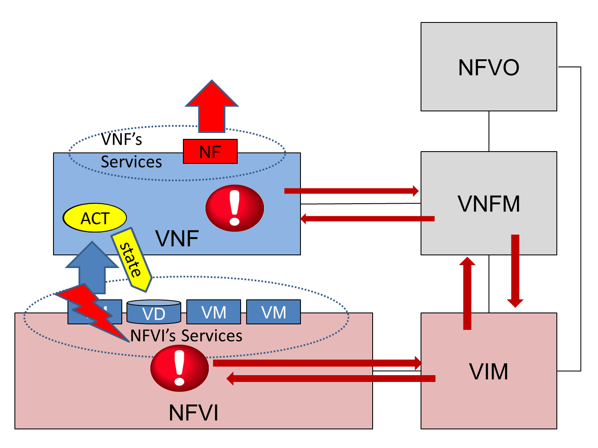

============
HA Use Cases
============

*****************
1 Basic Use Cases
*****************

In this section we review some of basic use cases related to service high availability,
that is, the availability of the service or function provided by a VNF. The goal is to
understand the different scenarios that need to be considered and their specificities
with respect to service high availability. More complex use cases will be discussed in
other sections.
With respect to service high availability we need to consider whether a VNF implementation is
statefull or stateless and if it includes or not an HA manager which handles redundancy.
For statefull VNFs we can also distinguish the cases when the state is maintained inside
of the VNF or it is stored in an external shared storage making the VNF itself virtually
stateless.

Managing availability usually implies a fault detection mechanism, which triggers the
actions necessary for fault isolation followed by the recovery from the fault.
This recovery includes two parts:

* the recovery of the service and
* the repair of the failed entity.

Very often the recovery of the service and the repair actions are perceived to be the same, for
example restarting a failed application repairs it and also it can provide the service again.
In cases when the service is protected by redundancy of the providing entities (e.g. appication
processes), the service is "failed over" to the standby or a spare entity, which replaces the
failed entity while it is being repaired. E.g. when an application process providing the service fails,
the standby application process takes over providing the service, while the failed one is restarted.
Such a failover often allows for faster recovery of the service.

We also need to distinguish between the failed and the faulty entities as a fault may or
may not manifest in the entity containing the fault. Faults may propagate, i.e. cause other entities
to fail or misbehave, i.e. an error, which in turn might be detected by a different failure or
error detector entity each of which has its own scope. Similarly, the managers acting on these
detected errors may have a limited scope. E.g. an HA manager conatined in a VNF can only repair
entities within the VNF. It cannot repair a failed VM, in  fact due to the layered architecture
in the VNF it cannot even know whether the VM failed, its hosting hypervisor, or the physical host.
But its error detection mechanism will detect the result of such failures - a failure in the VNF -
and the service can be recovered at the VNF level.
On the other hand, the failure should be detected in the NFVI and the VIM would need to repair
the failed entity. Accordingly a failure may be detected by different managers in different layers
of the system, each of which may react to the event. This may cause interference.
Thus to resolve the problem in a consistent manner and completely recover from
the failure the managers may need to collaborate and coordinate their actions.

Considering all these issues the following basic use cases can be identified (see table 1.).
These use cases assume that the failure is detected in the faulty entity (VNF component
or the VM).

*Table 1: VNF high availability use cases*

+---------+-------------------+----------------+-------------------+----------+
|         | VNF Statefullness | VNF Redundancy | Failure detection | Use Case |
+=========+===================+================+===================+==========+
| VNF     | yes               | yes            | VNF level only    | UC1      |
|         |                   |                +-------------------+----------+
|         |                   |                | VNF & NFVI levels | UC2      |
|         |                   +----------------+-------------------+----------+
|         |                   | no             | VNF level only    | UC3      |
|         |                   |                +-------------------+----------+
|         |                   |                | VNF & NFVI levels | UC4      |
|         +-------------------+----------------+-------------------+----------+
|         | no                | yes            | VNF level only    | UC5      |
|         |                   |                +-------------------+----------+
|         |                   |                | VNF & NFVI levels | UC6      |
|         |                   +----------------+-------------------+----------+
|         |                   | no             | VNF level only    | UC7      |
|         |                   |                +-------------------+----------+
|         |                   |                | VNF & NFVI levels | UC8      |
+---------+-------------------+----------------+-------------------+----------+

As discussed, there is no guarantee that a fault manifests within the faulty entity. For
example a memory leak in one process may impact or even crash any other process running in
the same execution environment. Accordingly, the repair of a failing entity (i.e. the crashed process)
may not resolve the problem and soon the same or another process may fail within this execution
environment indicating that the fault has remained in the system.
Thus, there is a need for extrapolating the failure to a wider scope and perform the
recovery at that level to get rid of the problem (at least temporarily till a patch is available
for our leaking process).
This requires the correlation of repeated failures in a wider scope and the escalation of the
recovery action to this wider scope. In the layered architecture this means that the manager detecting the
failure may not be the one in charge of the scope at which it can be resolved, so the escalation needs to
be forwarded to the manager in charge of that scope, which brings us to an additional use case UC9.

We need to consider for each of these use cases the events detected, their impact on other entities,
and the actions triggered to recover the service provided by the VNF, and to repair the
faulty entity.

We are going to describe each of the listed use cases from this perspective to better
understand how the problem of service high availability can be tackled the best
Before getting into the details it is worth mentioning the example end-to-end service recovery
times provided in the ETSI NFV REL document [REL]_ (see table 2.). These values may change over time
including lowering the threshold.

*Table 2: Service availability levels (SAL)*

+----+---------------+----------------------+------------------------------------+
|SAL |Service        |Customer Type         | Recommendation                     |
|    |Recovery       |                      |                                    |
|    |Time           |                      |                                    |
|    |Threshold      |                      |                                    |
+====+===============+======================+====================================+
|1   |5 ? 6 seconds  |Network Operator      |Redundant resources to be           |
|    |               |Control Traffic       |made available on-site to           |
|    |               |                      |ensure fastrecovery.                |
|    |               |Government/Regulatory |                                    |
|    |               |Emergency Services    |                                    |
+----+---------------+----------------------+------------------------------------+
|2   |10 ? 15 seconds|Enterprise and/or     |Redundant resources to be available |
|    |               |large scale customers |as a mix of on-site and off-site    |
|    |               |                      |as appropriate: On-site resources to|
|    |               |Network Operators     |be utilized for recovery of         |
|    |               |service traffic       |real-time service; Off-site         |
|    |               |                      |resources to be utilized for        |
|    |               |                      |recovery of data services           |
+----+---------------+----------------------+------------------------------------+
|3   |20 ? 25 seconds|General Consumer      |Redundant resources to be mostly    |
|    |               |Public and ISP        |available off-site. Real-time       |
|    |               |Traffic               |services should be recovered before |
|    |               |                      |data services                       |
+----+---------------+----------------------+------------------------------------+

Note that even though SAL 1 of [REL]_ allows for 5-6 seconds of service recovery,
for many services this is too long and such outage causes a service level reset or
the loss of significant amount of data. Also the end-to-end service or network service
may be served by multiple multiple VNFs. Therefore at the VNF level the desired
service recovery time is sub-second.

Note that failing over the service to another entity implies the redirection of the traffic
flow the VNF is handling. This could be achieved in different ways ranging from floating IP addresses
to load balancers. The topic deserves its own investigation, therefore in these first set of
use cases we assume that it is part of the solution without going into the details, which
we will address as a complementary set of use cases.

.. [REL] ETSI GS NFV-REL 001 V1.1.1 (2015-01)

1.1 Use Case 1: VNFC failure in a statefull VNF with redundacy
==============================================================

Use case 1 represents a statefull VNF with redundancy managed by an HA manager,
which is part of the VNF (Fig 1). The VNF consists of VNFC1, VNFC2 and the HA Manager.
The latter managing the two VNFCs, e.g. the role they play in providing the service
named "Provided NF" (Fig 2).

The failure happens in one of the VNFCs and it is detected and handled by the HA manager.
On practice the HA manager could be part of the VNFC implementations or it could
be a separate entity in the VNF. The point is that the communication of these
entities inside the VNF is not visible to the rest of the system. The observable
events need to cross the boundary represented by the VNF box.

.. figure:: images/Slide4.png
    :width: 80%
    :alt: VNFC failure in a statefull VNF
    :figclass: align-center

    Fig 1. VNFC failure in a statefull VNF with buit-in HA manager

    Fig 2. Sequence of events for use case 1

As shown in Fig 2. initially VNFC2 is active, i.e. provides the Provided NF and VNFC1
is a standby. It is not shown, but it is expected that VNFC1 has some means to get the update
of the state of the Provided NF from the active VNFC2, so that it is prepared to continue to
provide the service in case VNFC2 fails.
The sequence of events starts with the failure of VNFC2, which also interrupts the
Provided NF. This failure is detected somehow and/or reported to the HA Manager, which
in turn may report the failure to the VNFM and simultaneously it tries to isolate the
fault by clening up VNFC2.

Once the cleanup succeeds (i.e. the OK is received) it fails over the active role to
VNFC1 by setting it active. This recovers the service, the Provided NF is indeed
provided again. Thus this point marks the end of the outage caused by the failure
that need to be considered from the perspective of service availability.

The repair of the failed VNFC2, which might have started at the same time
when VNFC1 was assigned the active state, may take longer but without further impact
on the availability of the Provided NF service.
If the HA Manager reported the interruption of the Provided NF to the VNFM, it should
clear the error condition.

The key points in this scenario are:

* The failure of the VNFC2 is not detectable by any other part of the system except
  the consumer of the Provided NF. The VNFM only
  knows about the failure because of the error report, and only the information this
  report provides. I.e. it may or may not include the information on what failed.
* The Provided NF is resumed as soon as VNFC1 is assigned active regardless how long
  it takes to repair VNFC2.
* The HA manager could be part of the VNFM as well. It requires an interface to
  detect the failures and to manage the VNFC life-cycle and the role assignments.

1.2 Use Case 2: VM failure in a statefull VNF with redundacy
============================================================

Use case 2 also represents a statefull VNF with its redundancy managed by an HA manager,
which is part of the VNF. The VNFCs of the VNF are hosted on the VMs provided by
the NFVI (Fig 3).

The VNF consists of VNFC1, VNFC2 and the HA Manager (Fig 4). The latter managing
the role the VNFCs play in providing the service - Provided NF.
The VMs provided by the NFVI are managed by the VIM.

In this use case it is one of the VMs hosting the VNF fails. The failure is detected
and handled at both the NFVI and the VNF levels simultaneously. The coordination occurs
between the VIM and the VNFM.

    Fig 3. VM failure in a statefull VNF with buit-in HA manager

    Fig 4. Sequence of events for use case 2

Again initially VNFC2 is active and provides the Provided NF, while VNFC1 is the standby.
It is not shown in Fig 4., but it is expected that VNFC1 has some means to learn the state
of the Provided NF from the active VNFC2, so that it is able to continue providing the
service if VNFC2 fails. VNFC1 is hosted on VM1, while VNFC2 is hosted on VM2 as indicated by
the arrows between these objects in Fig 4.

The sequence of events starts with the failure of VM2, which results in VNFC2 failing and
interrupting the Provided NF. The HA Manager detects the failure of VNFC2 somehow
and tries to handle it the same way as in use case 1. However because the VM is gone the
clean up either not initiated at all or interrupted as soon as the failure of the VM is
identified. In either case the faulty VNFC2 is considered as isolated.

To recover the service the HA Manager fails over the active role to VNFC1 by setting it active.
This recovers the Provided NF. Thus this point marks again the end of the outage caused
by the VM failure that need to be considered from the perspective of service availability.
If the HA Manager reported the interruption of the Provided NF to the VNFM, it should
clear the error condition.

On the other hand the failure of the VM is also detected in the NFVI and reported to the VIM.
The VIM reports the VM failure to the VNFM, which passes on this information
to the HA Manager of the VNF. This confirms for the VNF HA Manager the VM failure and that
it needs to wait with the repair of the faild VNFC2 until the VM is provided again. The
VNFM also confirms towards the VIM that it is safe to restart the VM.

The repair of the failed VM may take some time, but since the service has been failed over
to VNFC1 in the VNF, there is no further impact on the availability of Provided NF.

When eventually VM2 is restarted the VIM reports this to the VNFM and
the VNFC2 can be restored.

The key points in this scenario are:

* The failure of the VM2 is detectable at both levels VNF and NFVI, therefore both the HA
  manager and the VIM reacts to it. It is essential that these reactions do not interfere,
  e.g. if the VIM tries to protect the VM state at NFVI level that would conflict with the
  service failover action at the VNF level.
* While the failure detection happens at both NFVI and VNF levels, the time frame within
  which the VIM and the HA manager detects and reacts may be very different. For service
  availability the VNF level detection, i.e. by the HA manager is the critical one and expected
  to be faster.
* The Provided NF is resumed as soon as VNFC1 is assigned active regardless how long
  it takes to repair VM2 and VNFC2.
* The HA manager could be part of the VNFM as well.
  It requires an interface to detect the VNFC failures and to manage its life-cycle and
  role assignments.
* The VNFM may not know for sure that the VM failed until the VIM reports it, i.e. whether
  the VM failure is due to host, hypervisor, host OS failure. The use cases for these failures
  are similar with respect to each Provided NF.
* The VM repair also should start with the fault isolation as appropriate for the actual
  failed entity, e.g. if the VM failed due to a host failure a host may be fenced first.
* The negotiation between the VNFM and the VIM may be replaced by repair policies.

1.3 Use Case 3: VNFC failure in a statefull VNF with no redundacy
=================================================================

Use case 3 also represents a statefull VNF, but it stores its state externally on a
virtual disk provided by the NFVI. It has a single VNFC and it is managed by the VNFM
(Fig 5).

In this use case again the VNFC fails and the failure is detected and handled by the VNFM.

    Fig 5. VNFC failure in a statefull VNF with no redundancy

    Fig 6. Sequence of events for use case 3

The VNFC periodically checkpoints the state of the Provided NF to the external storage,
so that in case of failure the Provided NF can be resumed (Fig 6).

When the VNFC fails the Provided NF is interrupted. The failure is detected by the VNFM
somehow, which to isolate the fault first cleans up the VNFC, then if the cleanup is
successful it restarts the VNFC. When the VNFC starts up, first it reads the last checkpoint
for the Provided NF, then resumes providing it. The service outage lasts from the VNFC failure
till this moment.

The key points in this scenario are:

* The service state is saved in an external storage which should be highly available too to
  protect the service.
* The NFVI should provide this guarantee and also that storage and access network failures
  are handled seemlessly from the VNF's perspective.
* The VNFM has means to detect VNFC failures and manage its lifecycle appropriately. This is
  not required if the VNF also provides its availability management.
* The Provided NF can be resumed only after the VNFC is restarted and it has restored the
  service state from the last checkpoint created before the failure.

1.4 Use Case 4: VM failure in a statefull VNF with no redundacy
===============================================================

Use case 4 also represents a statefull VNF without redundancy, which stores its state externally on a
virtual disk provided by the NFVI. It has a single VNFC managed by the VNFM
(Fig 7) as in use case 3.

In this use case the VM hosting the VNFC fails and the failure is detected and handled by
the VNFM and the VIM simultaneously.

    Fig 7. VM failure in a statefull VNF with no redundancy

    Fig 8. Sequence of events for use case 4

Again, the VNFC regularly checkpoints the state of the Provided NF to the external storage,
so that it can be resumed in case of a failure (Fig 8).

When the VM hosting the VNFC fails the Provided NF is interrupted.

On one hand side, the failure is detected by the VNFM somehow, which to isolate the fault tries
to clean the VNFC up which cannot be done because of the VM failure. When the absence of the VM has been
determined the VNFM has to wait with restarting the VNFC until the hosting VM is restored. The VNFM
may report the problem to the VIM, requesting a repair.

On the other hand the failure is detected in the NFVI and reported to the VIM, which reports it
to the VNFM, if the VNFM hasn't reported it yet.
If the VNFM has requested the VM repair or if it acknowledges the repair, the VIM restarts the VM.
Once the VM is up the VIM reports it to the VNFM, which in turn can restart the VNFC.

When the VNFC restarts first it reads the last checkpoint for the Provided NF,
to be able to resume it.
The service outage lasts till this moment.

The key points in this scenario are:

* The service state is saved in external storage which should be highly available to
  protect the service.
* The NFVI should provide such a guarantee and also that storage and access network failures
  are handled seemlessly from the perspective of the VNF.
* The Provided NF can be resumed only after the VM and the VNFC are restarted and the VNFC
  has restored the service state from the last checkpoint created before the failure.
* The VNFM has means to detect VNFC failures and manage its lifecycle appropriately. Alternatively
  the VNF may also provide its availability management.
* The VNFM may not know for sure that the VM failed until the VIM reports this. It also cannot
  distinguish host, hypervisor and host OS failures. The use cases for these failures are
  similar with respect to each Provided NF.
* The VM repair also should start with the fault isolation as appropriate for the actual
  failed entity, e.g. if the VM failed due to a host failure a host may be fenced first.
* The repair negotiation between the VNFM and the VIM may be replaced by repair policies.

1.5 Use Case 5: VNFC failure in a stateless VNF with redundancy
===============================================================

Use case 5 represents a stateless VNF with redundancy, i.e. it is composed of VNFC1 and VNFC2.
They are managed by an HA manager within the VNF. The HA manager assigns the active role to provide
the Provided NF to one of the VNFCs while the other remains a spare meaning that it has no state
information for the Provided NF (Fig 9) therefor it could replace any other VNFC capable of
providing the Provided NF service.

In this use case the VNFC fails and the failure is detected and handled by the HA manager.

    Fig 9. VNFC failure in a stateless VNF with redundancy

    Fig 10. Sequence of events for use case 5

Initially VNFC2 provides the Provided NF while VNFC1 is idle or might not even been instatiated
yet (Fig 10).

When VNFC2 fails the Provided NF is interrupted. This failure is detected by the HA manager,
which as a first reaction cleans up VNFC2 (fault isolation), then it assigns the active role to
VNFC1. It may report an error to the VNFM as well.

Since there is no state information to recover, VNFC1 can accept the active role right away
and resume providing the Provided NF service. Thus the service outage is over. If the HA manager
reported an error to the VNFM it should clear it at this point.

The key points in this scenario are:

* The spare VNFC may be instantiated only once the failure of active VNFC is detected.
* As a result the HA manager's role might be limited to lifecycle management, i.e. no role
  assignment is needed if the VNFCs provide the service as soon as they are started up.
* Accordingly the HA management could be part of a generic VNFM provided it is capable of detecting
  the VNFC failures.
* Also there could be multiple active VNFCs sharing the load of Provided NF and the spare/standby
  may protect all of them.
* Besides the service users, the VNFC failure may not be detectable at any other part of the system.
* Reporting the service failure to the VNFM is optional as the HA manager is in charge recovering
  the service and it is aware of the redundancy needed to do so.

1.6 Use Case 6: VM failure in a stateless VNF with redundacy
============================================================

Similarly to use case 5, use case 6 represents a stateless VNF composed of VNFC1 and VNFC2,
which are managed by an HA manager within the VNF. The HA manager assigns the active role to
provide the Provided NF to one of the VNFCs while the other remains a spare meaning that it has
no state information for the Provided NF (Fig 11) and it could replace any other VNFC capable
of providing the Provided NF service.

As opposed to use case 5 in this use case the VM hosting one of the VNFCs fails. This failure is
detected and handled by the HA manager as well as the VIM.

    Fig 11. VM failure in a stateless VNF with redundancy

    Fig 12. Sequence of events for use case 6

Initially VNFC2 provides the Provided NF while VNFC1 is idle or might not have been instatiated
yet (Fig 12) as in use case 5.

When VM2 fails VNFC2 fails with it and the Provided NF is interrupted. The failure is detected by
the HA manager and by the VIM simultaneously and independently.

The HA manager's first reaction is trying to clean up VNFC2 to isolate the fault. This is considered to
be successful as soon as the disappearance of the VM is confirmed.
After this the HA manager assigns the active role to VNFC1. It may report the error to the VNFM as well
requesting a VM repair.

Since there is no state information to recover, VNFC1 can accept the assignment right away
and resume the Provided NF service. Thus the service outage is over. If the HA manager reported
an error to the VNFM for the service it should clear it at this point.

Simultaneously the VM failure is detected in the NFVI and reported to the VIM, which reports it
to the VNFM, if the VNFM hasn't requested a repair yet. If the VNFM requested the VM repair or if
it acknowledges the repair, the VIM restarts the VM.

Once the VM is up the VIM reports it to the VNFM, which in turn may restart the VNFC if needed.

The key points in this scenario are:

* The spare VNFC may be instantiated only after the detection of the failure of the active VNFC.
* As a result the HA manager's role might be limited to lifecycle management, i.e. no role
  assignment is needed if the VNFC provides the service as soon as it is started up.
* Accordingly the HA management could be part of a generic VNFM provided if it is capable of detecting
  the VNFC failures and managing its life-cycle.
* Also there could be multiple active VNFCs sharing the load of Provided NF and the spare/standby
  may protect all of them.
* The VNFM may not know for sure that the VM failed until the VIM reports this. It also cannot
  distinguish host, hypervisor and host OS failures. The use cases for these failures are
  similar with respect to each Provided NF.
* The VM repair also should start with the fault isolation as appropriate for the actual
  failed entity, e.g. if the VM failed due to a host failure a host needs to be fenced first.
* The negotiation between the VNFM and the VIM may be replaced by repair policies.
* Reporting the service failure to the VNFM is optional as the HA manager is in charge recovering
  the service and it is aware of the redundancy needed to do so.

1.7 Use Case 7: VNFC failure in a stateless VNF with no redundancy
==================================================================

Use case 7 represents a stateless VNF composed of a single VNFC, i.e. with no redundancy.
The VNF and in particular is VNFC is managed by the VNFM through managing its lifecycle (Fig 13).

In this use case the VNFC fails. This failure is detected and handled by the VNFM. This use case
requires that the VNFM can detect the failures in the VNF or they are reported to the VNFM.

The failure is only detectable at the VNFM level and it is handled by the VNFM restarting the VNFC.

    Fig 13. VNFC failure in a stateless VNF with no redundancy

    Fig 14. Sequence of events for use case 7

The VNFC is providing the Provided NF when it fails (Fig 14). This failure is detected or reported to
the VNFM, which has to clean up the VNFC to isolate the fault. After cleanup success it can proceed
with restarting the VNFC, which as soon as it is up it starts to provide the Provided NF
as there is no state to recover.

Thus the service outage is over, but it has inclueded the entire time needed to restart the VNFC.
Considering that the VNF is stateless this may not be significant still.

The key points in this scenario are:

* The VNFM has to have the means to detect VNFC failures and manage its lifecycle appropriately.
  This is not required if the VNF comes with its availability management, but this is very unlikely
  for such stateless VNFs.
* The Provided NF can be resumed as soon as the VNFC is restarted, i.e. the restart time determines
  the outage.
* In case multiple VNFCs are used they should not interfere with one another, they should
  operate independently.

1.8 Use Case 8: VM failure in a stateless VNF with no redundancy
================================================================

Use case 8 represents the same stateless VNF composed of a single VNFC as use case 7, i.e. with
no redundancy. The VNF and in particular is VNFC is managed by the VNFM through managing its
lifecycle (Fig 15).

In this use case the VM hosting the VNFC fails. This failure is detected and handled by the VNFM
as well as by the VIM.

    Fig 15. VM failure in a stateless VNF with no redundancy

    Fig 16. Sequence of events for use case 8

The VNFC is providing the Provided NF when the VM hosting the VNFC fails (Fig 16).
This failure may be detected or reported to the VNFM as a failure of the VNFC. I.e. the VNFM may not
be aware at this point that it is a VM failure. Accordingly its first reaction as in use case 7
is to clean up the VNFC to isolate the fault. Since VM is gone, this cannot succeed and the VNFM becomes aware
of the VM failure through this or it is reported by the VIM. In either case it has to wait with the
repair of the VMFC until the VM becomes available again.

Meanwhile the VIM also detects the VM failure and reports it to the VNFM unless the VNFM has already
requested the VM repair. After the VNFM confirming the VM repair the VIM restarts the VM and reports
the successful repair to the VNFM, which in turn can start the VNFC on it.

Thus the recovery of the Provided NF includes the restart time of the VM and the VNFC.

The key points in this scenario are:

* The VNFM has to have the means to detect VNFC failures and manage its lifecycle appropriately.
  This is not required if the VNF comes with its availability management, but this is very unlikely
  for such stateless VNFs.
* The Provided NF can be resumed only after the VNFC is restarted on the repaired VM, i.e. the
  restart time of the VM and the VNFC determines the outage.
* In case multiple VNFCs are used they should not interfere with one another, they should

  operate independently.
* The VNFM may not know for sure that the VM failed until the VIM reports this. It also cannot
  distinguish host, hypervisor and host OS failures. The use cases for these failures are
  similar with respect to each Provided NF.
* The VM repair also should start with the fault isolation as appropriate for the actual
  failed entity, e.g. if the VM failed due to a host failure the host needs to be fenced first.
* The repair negotiation between the VNFM and the VIM may be replaced by repair policies.

1.9 Use Case 9: Repeated VNFC failure in a stateless VNF with no redundancy
===========================================================================

Finally use case 9 represents again a stateless VNF composed of a single VNFC as use case 7, i.e. with
no redundancy. The VNF and in particular is VNFC is managed by the VNFM through managing its
lifecycle.

In this use case the VNFC fails repeatedly. This failure is detected and handled by the VNFM,
but results in no resolution of the fault (Fig 17) because the VNFC is manifesting a fault,
which is not in its scope. I.e. the fault is propagating to the VNFC from a faulty VM or host,
for example. Thus the VNFM cannot resolve the problem by itself.

    Fig 17. VM failure in a stateless VNF with no redundancy

To handle this case the failure handling needs to be escalated to the a bigger fault zone
(or fault domain), i.e. a scope within which the faults may propagate and manifest. In case of the
VNF the bigger fault zone is the VM and the facilities hosting it, all managed by the VIM.

Thus the VNFM should request the repair from the VIM (Fig 18).

Since the VNFM is only aware of the VM, it needs to report an error on the VM and it is the
VIM's responsibility to sort out what might be the scope of the actual fault depending on other
failures and error reports in its scope.

    Fig 18. VM failure in a stateless VNF with no redundancy

    Fig 19. Sequence of events for use case 9

This use case starts similarly to use case 7, i.e. the VNFC is provideing the Provided NF when it fails (Fig 17).
This failure is detected or reported to the VNFM, which cleans up the VNFC to isolate the fault.
After successful cleanup the VNFM proceeds with restarting the VNFC, which as soon as it is up
starts to provide the Provided NF again as in use case 7.

However the VNFC failure occurs N times repeatedly within some Probation time for which the VNFM starts
the timer when it detects the first failure of the VNFC. When the VNFC fails once more still within the
probation time the Escalation counter maximum is exceeded and the VNFM reports an error to the VIM on
the VM hosting the VNFC as obviously cleaning up and restarting the VNFC did not solve the problem.

When the VIM receives the error report for the VM it has to isolate the fault by cleaning up at least
the VM. After successful cleanup it can restart the VM and once it is up report the VM repair to the VNFM.
At this point the VNFM can restart the VNFC, which in turn resumes the Provided VM.

In this scenario the VIM needs to evaluate what may be the scope of the fault to determine what entity
needs a repair. For example, if it has detected VM failures on that same host, or other VNFMs
reported errors on VMs hosted on the same host, it should consider that the entire host needs a repair.

The key points in this scenario are:

* The VNFM has to have the means to detect VNFC failures and manage its lifecycle appropriately.
  This is not required if the VNF comes with its availability management, but this is very unlikely
  for such stateless VNFs.
* The VNFM needs to correlate VNFC failures over time to be able to detect failure of a bigger fault zone.
  One way to do so is through counting the failures within a probation time.
* The VIM cannot detect all failures caused by faults in the entities under its control. It should be
  able to receive error reports and correlate these error reports based on the dependencies
  of the different entities.
* The VNFM does not know the source of the failure, i.e. the faulty entity.
* The VM repair should start with the fault isolation as appropriate for the actual
  failed entity, e.g. if the VM failed due to a host failure the host needs to be fenced first.
