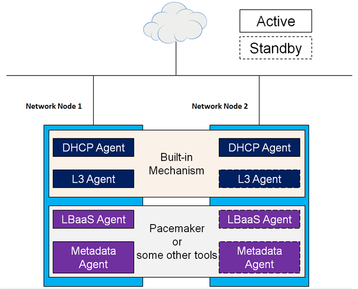
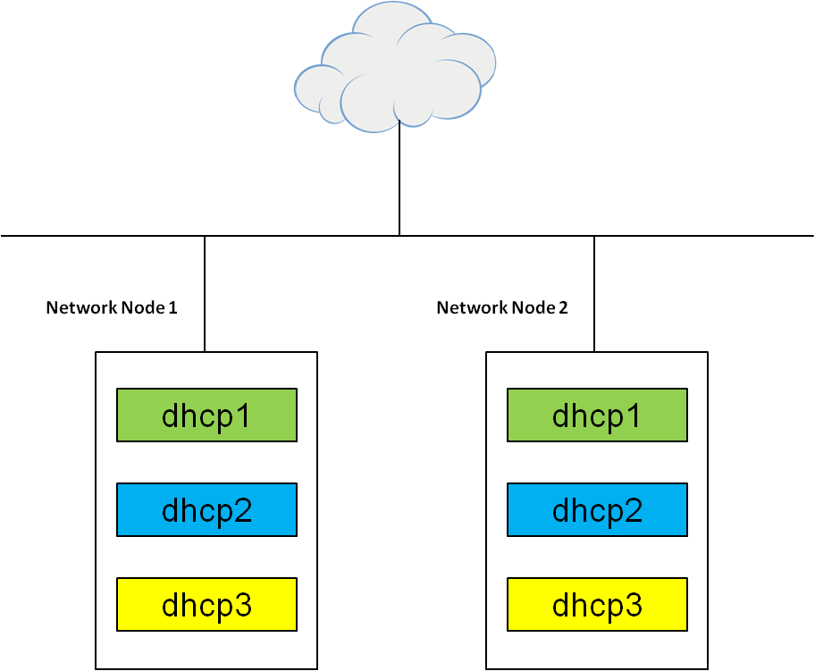
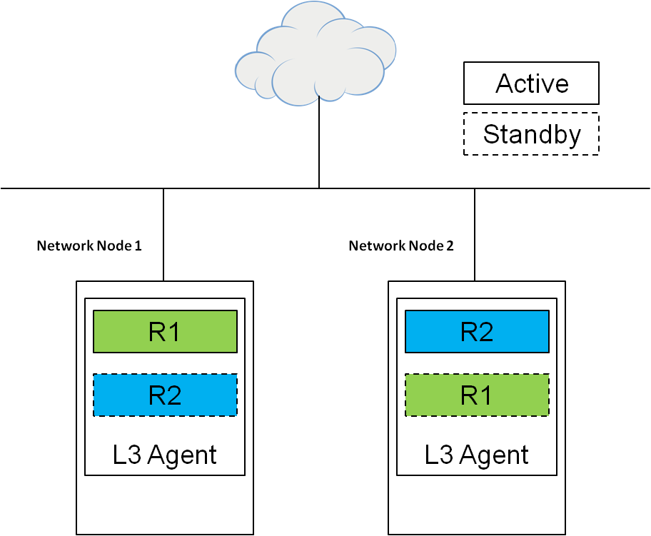
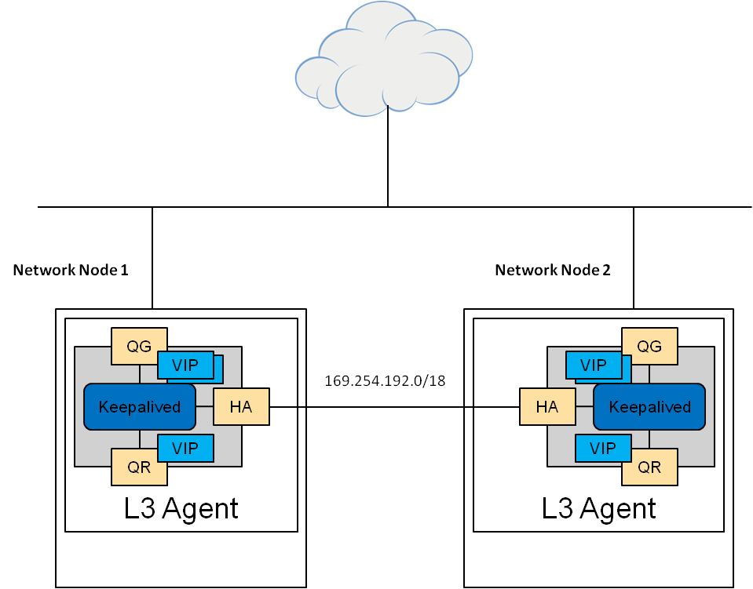
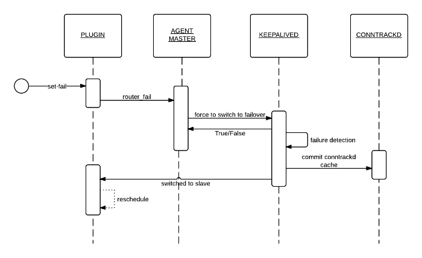
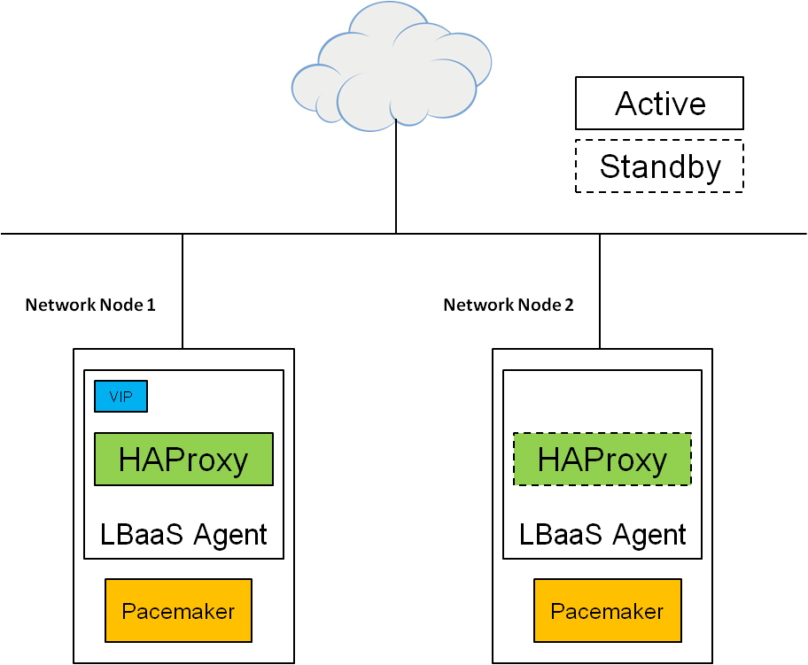
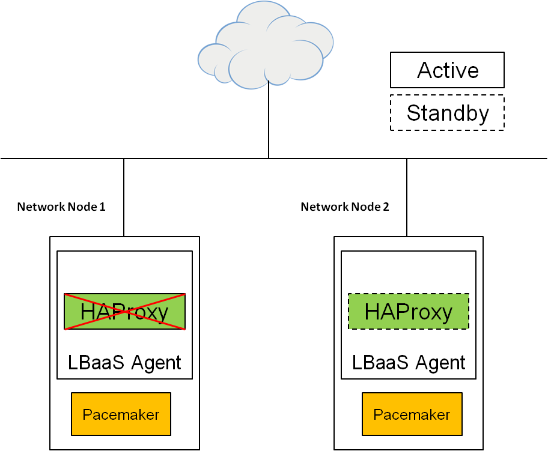

HA Scenario Analysis
====================

Use cases for network nodes
---------------------------

OpenStack network nodes contain: Neutron DHCP agent, Neutron L2 agent, Neutron L3 agent, Neutron LBaaS
agent and Neutron Metadata agent. The DHCP agent provides DHCP services for virtual networks. The
metadata agent provides configuration information such as credentials to instances. Note that the
L2 agent cannot be distributed and highly available. Instead, it must be installed on each data
forwarding node to control the virtual network drivers such as Open vSwitch or Linux Bridge. One L2
agent runs per node and controls its virtual interfaces.

A typical HA deployment of network nodes can be achieved in Fig 1. Here shows a two nodes cluster.
The number of the nodes is decided by the size of the cluster. It can be 2 or more. More details can be
achieved from each agent's part.

    Fig 1. A typical HA deployment of network nodes

DHCP agent
^^^^^^^^^^

The DHCP agent can be natively highly available. Neutron has a scheduler which lets you run multiple
agents across nodes. You can configure the dhcp_agents_per_network parameter in the neutron.conf file
and set it to X (X >=2 for HA, default is 1).

If the X is set to 2, as depicted in Fig 2 three tenant networks (there can be multiple tenant networks)
are used as an example, six DHCP agents are deployed in two nodes for three networks, they are
all active. Two dhcp1s serve one network, dhcp2s and dhcp3s serve other two different networks. In a
network, all DHCP traffic is broadcast, DHCP servers race to offer IP. All the servers will update the
lease tables. In Fig 3, when the agent(s) in Node1 doesn't work which can be caused by software
failure or hardware failure, the dhcp agent(s) on Node2 will continue to offer IP for the network.

    Fig 2. Natively HA deployment of DHCP agents

.. figure:: images_network_nodes/DHCP_failure.png
    :alt: Failure of DHCP agents
    :figclass: align-center

    Fig 3. Failure of DHCP agents

L3 agent
^^^^^^^^

The L3 agent is also natively highly available. To achieve HA, it can be configured in the neutron.conf
file.

.. code-block::

    l3_ha = True # All routers are highly available by default

    allow<F7>_automatic_l3agent_failover =  True # Set automatic L3 agent failover for routers

    max_l3_agents_per_router = 2 # Maximum number of network nodes to use for the HA router

    min_l3_agents_per_router = 2 # Minimum number of network nodes to use for the HA router. A new router
    can be created only if this number of network nodes are available.

According to the neutron.conf file, the L3 agent scheduler supports Virtual Router Redundancy
Protocol (VRRP) to distribute virtual routers across multiple nodes (e.g. 2). The scheduler will choose
a number between the maximum and the minimum number according scheduling algorithm. VRRP is implemented
by Keepalived.

As depicted in Fig 4, both L3 agents in Node1 and Node2 host vRouter 1 and vRouter 2. In Node 1,
vRouter 1 is active and vRouter 2 is standby (hot standby). In Node2, vRouter 1 is standby and
vRouter 2 is active. For the purpose of reducing the load, two actives are deployed in two Nodes
alternatively. In Fig 5, Keepalived will be used to manage the VIP interfaces. One instance of
keepalived per virtual router, then one per namespace. 169.254.192.0/18 is a dedicated HA network
which is created in order to isolate the administrative traffic from the tenant traffic, each vRouter
will be connected to this dedicated network via an HA port. More details can be achieved from the
Reference at the bottom.

    Fig 4. Natively HA deployment of L3 agents

    Fig 5. Natively HA principle of L3 agents

In Fig 6, when vRouter 1 in Node1 is down which can be caused by software failure or hardware failure,
the Keepalived will detect the failure and the standby will take over to be active. In order to keep the
TCP connection, Conntrackd is used to maintain the TCP sessions going through the router. One instance
of conntrackd per virtual router, then one per namespace. After then, a rescheduling procedure will be
triggered to respawn the failed virtual router to another l3 agent as standby. All the workflows is
depicted in Fig 7.

.. figure:: images_network_nodes/L3_failure.png
    :alt: Failure of L3 agents
    :figclass: align-center

    Fig 6. Failure of L3 agents

    Fig 7. HA workflow of L3 agents

LBaaS agent and Metadata agent
^^^^^^^^^^^^^^^^^^^^^^^^^^^^^^

Currently, no native feature is provided to make the LBaaS agent highly available using the defaul
plug-in HAProxy. A common way to make HAProxy highly available is to use Pacemaker.

    Fig 8. HA deployment of LBaaS agents using Pacemaker

As shown in Fig 8 HAProxy and pacemaker are deployed in both of the network nodes. The number of network
nodes can be 2 or more. It depends on your cluster. HAProxy in Node 1 is the master and the VIP is in
Node 1. Pacemaker monitors the liveness of HAProxy.

    Fig 9. Failure of LBaaS agents

As shown in Fig 9 when HAProxy in Node1 falls down which can be caused by software failure or hardware
failure, Pacemaker will fail over HAProxy and the VIP to Node 2.

Note that the default plug-in HAProxy only supports TCP and HTTP.

No native feature is available to make Metadata agent highly available. At this time, the Active/Passive
solution exists to run the neutron metadata agent in failover mode with Pacemaker. The deployment and
failover procedure can be the same as the case of LBaaS.

Reference
---------

* OpenStack HA guide: http://docs.openstack.org/ha-guide/networking-ha.html

* L3 High Availability VRRP: https://wiki.openstack.org/wiki/Neutron/L3_High_Availability_VRRP

**Documentation tracking**

Revision: _sha1

Build date:  _date
